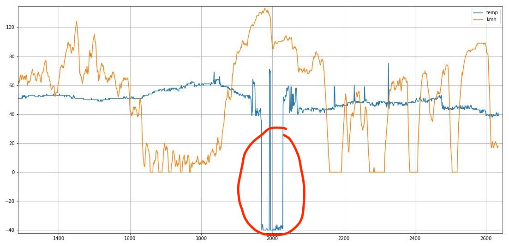

Python logger to capture OBD2 metrics as a CSV flat file.

I forked this repo from https://github.com/roflson/pyobd and adapted it to run
on a Raspberry PI B. Specifically I adapted the `obd_recorder.py` file with my
specific needs. To configure it to your needs, I would suggest scratching around
there. The original author did not use any sort of environment config so take it
as is.

# Use-case
Our Renault Sandero was giving us a strange issue that two mechanics could not
help us with. The car would lose power while driving such that the more you gas
you gave the slower the car would go until it eventually died. It would then
take several tries to get it going again. The worst part was that this behaviour
was sporadic where it could happen twice a week, en then again in three months
time. And obviously whenever you took it to the mechanic, it was purring like a
kitten. Needless to say it was stressful driving around Cape Town not knowing
when it will strike again. And I couldn't exactly sell the car in this state
even if it was unlikely to happen during a test drive... Not with a clean
conscious anyway. 

My first theory was that the idle control valve was broken and was over
enriching the fuel mixture (hence the strong smell of gas once you got the
engine going again). I replaced it with a 3rd party version which of course
correlated with a nice long stretch of time where the issue was "fixed", lulling
me into a false sense of security while patting myself on the back.

I queried the OBD2 port for diagnostics (as the mechanics did) but gave nothing.
I couldn't exactly drive around for months with my laptop open next to me, or
worse ask my wife to do the same. So I devised a Raspberry Pi that would live in
the glove box and be powered from the cigarette lighter. It would record all the
metrics available from the OBD2 connection.

After only a couple of weeks, it finally happened again going down the R300 and
for the first time I was happy it did. In the graph below you can see the speed
and water temperature plotted. You can see the temperature gauge drops to
-40degC. When this happens the EMU thinks the car just started and opens the
idle control valve. This floods the engine causing it to stall. **Fixing it only
required cleaning up the electrical connection to the temperature sensor with a
bit of Q20**.




# Dependencies
- A car with an OBD2 port 😉
- OBD2 USB cable
- A raspberry Pi with Python 3.x installed.

# Getting started
```sh
# Copy the code to the home dir of your PI (configure the IP adr)
# This assumes that the pi is on your network 
PI_IP="192.168.8.119"
rsync -ra .../pyobd pi@:$PI_IP/home/pi/


# Plug the OBD2 cable into your car and test by running the following on the Pi.
# (for my specific car I had to start the engine first). 
# If this works it should produce a /home/pi/pyobd/logs directory that contains the CSV capture (see example_output/)
/home/pi/pyobd/obd_recorder.py

# If the above worked, configure the Pi to run the script on startup by adding the following line to /etc/rc.local
/home/pi/pyobd/obd_recorder.py >> /home/pi/obd.log 2>&1 &

# My procedure was to always start the car, then plug in the Pi power to start the logging. Your car might be different.
# Remeber to NOT leave the Pi plugged in for long time while the engine is off since it will eventually drain your battery 
```

# Resources
- This original repo: https://github.com/roflson/pyobd
- List of OBD2 tools: https://www.elmelectronics.com/help/obd/software/#Linux
